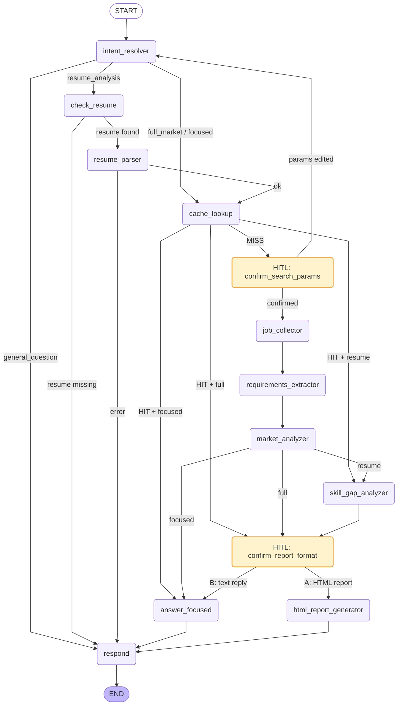

# Job Market Intelligence System

An agentic AI system that analyses job market demand and provides personalised resume recommendations. Built with **LangGraph** to demonstrate production-grade agentic AI patterns: dynamic intent routing, persistent caching, human-in-the-loop (HITL), structured LLM outputs, and full-stack deployment.

> **Portfolio project** — showcasing skills in LangGraph, multi-agent orchestration, FastAPI, and agentic system design.

---

## What It Does

Ask the system anything about the job market or your career:

| Request | What Happens |
|---|---|
| *"Do a full market analysis for AI Engineers in Germany"* | Searches real job postings, aggregates skill demand, generates a downloadable HTML report |
| *"What are the most in-demand cloud platforms for ML jobs in the US?"* | Collects job data, extracts cloud platform mentions, answers the specific question |
| *"What skills should I learn next?"* | Reads your uploaded resume, compares it against the market, recommends the highest-impact skills to learn |
| *"What is the difference between RAG and fine-tuning?"* | Answers directly from AI knowledge — no job data needed |

Before running any expensive job search, the system asks you to confirm the parameters. After analysis it asks whether you want a full HTML report or a chat summary. **You are always in control.**

---

## System Architecture

```
┌──────────────────────────────────────────────────────────────────────┐
│                           User Interface                             │
│               GitHub Pages (Phase 3)  /  Terminal (Phase 1)         │
└───────────────────────────┬──────────────────────────────────────────┘
                            │  HTTP + SSE  /  direct graph.invoke()
┌───────────────────────────▼──────────────────────────────────────────┐
│                    FastAPI Backend  (Phase 2)                        │
│   POST /api/chat          POST /api/chat/resume                      │
│   GET  /api/chat/history  GET  /api/reports/{session}/{file}         │
└───────────────────────────┬──────────────────────────────────────────┘
                            │
┌───────────────────────────▼──────────────────────────────────────────┐
│                      LangGraph  StateGraph                           │
│                                                                      │
│  ┌─────────────────┐                                                 │
│  │ intent_resolver │  gpt-4o-mini — classifies into 4 intents       │
│  └────────┬────────┘                                                 │
│           │                                                          │
│    ┌──────┴───────────────────────────────────┐                     │
│    │              │              │             │                     │
│  general     focused_q   full_market    resume_analysis             │
│    │          question    _analysis           │                     │
│    │              │              │        [check_resume]            │
│    │         [cache_lookup]  [cache_lookup]   │                     │
│    │           MISS |HIT     MISS | HIT   [resume_parser]           │
│    │            │    │        │    │           │                     │
│    │     [HITL: confirm params]    │      [cache_lookup]            │
│    │            │              │       MISS | HIT                   │
│    │     [job_collector]       │        │    │                      │
│    │     [req_extractor]       │  [HITL: confirm params]            │
│    │     [market_analyzer]─────┴───────┤    │                      │
│    │          cached ──────────────────┘    │                      │
│    │              │                    [skill_gap_analyzer]         │
│    │     [answer_focused]    [HITL: report format?]                 │
│    │                          A:HTML  |  B:Text                     │
│    │              [html_report_generator]  [answer_focused]         │
│    │                                                                 │
│    └──────────────────────── [respond] ─────────────────────────── │
└───────────────────────────┬──────────────────────────────────────────┘
                            │
           ┌────────────────┴────────────────┐
           │                                 │
┌──────────▼──────────┐           ┌──────────▼──────────┐
│   SQLite / Postgres │           │     OpenAI API      │
│                     │           │                     │
│  market_cache       │           │  gpt-4o-mini        │
│  sessions           │           │  · intent classify  │
│  conv_history       │           │  · req extraction   │
│  LG checkpoints     │           │                     │
└─────────────────────┘           │  gpt-4o             │
                                  │  · market analysis  │
┌─────────────────────┐           │  · skill gap        │
│  SerpAPI            │           │  · HTML report gen  │
│  Google Jobs API    │           └─────────────────────┘
└─────────────────────┘
```

---

## LangGraph Graph

The graph is a `StateGraph` with **13 nodes** and fully dynamic routing driven by user intent and cache state. The diagram below is auto-generated via `graph.get_graph().draw_mermaid()`.



### Node Reference

| Node | Type | Model | Description |
|---|---|---|---|
| `intent_resolver` | LLM | gpt-4o-mini | Classifies message into 1 of 4 intents, extracts job_titles / country / topic |
| `check_resume` | Logic | — | Checks if a resume PDF is in the session store (no LLM) |
| `resume_parser` | Tool | — | Extracts text from uploaded PDF bytes via `pypdf` |
| `cache_lookup` | DB | — | SHA256(titles+country+date) → checks SQLite/Postgres cache |
| `confirm_search_params` | **HITL** | — | `interrupt()` — shows proposed params, waits for user confirmation |
| `job_collector` | Tool | — | SerpAPI Google Jobs — collects N real job postings |
| `requirements_extractor` | LLM | gpt-4o-mini | Structured extraction of skills / cloud platforms / certs per posting |
| `market_analyzer` | LLM | gpt-4o | Aggregates across all postings → markdown report, writes to cache |
| `skill_gap_analyzer` | LLM | gpt-4o | Compares resume skills vs. market demand |
| `answer_focused` | LLM | gpt-4o-mini | Answers narrow question from market data |
| `confirm_report_format` | **HITL** | — | `interrupt()` — asks user: HTML report or text summary? |
| `html_report_generator` | LLM + Tool | gpt-4o | Generates full styled HTML report, saves to `outputs/{session_id}/` |
| `respond` | Compose | — | Formats final reply, saves to conversation history DB |

---

## The 4 Intents

```
User message
     │
     ▼
[intent_resolver]  (gpt-4o-mini, structured output)
     │
     ├── general_question ────► Direct LLM answer, zero tools
     │   "What is LangGraph?"
     │   "How do I write a good resume?"
     │
     ├── focused_question ────► Market data ──► specific answer (no report HITL)
     │   "Most popular cloud platforms for ML jobs in Germany?"
     │   "Which databases appear most in backend job postings?"
     │
     ├── full_market_analysis ► Full pipeline ──► 2x HITL ──► optional HTML report
     │   "Full analysis for Data Engineers in the UK"
     │
     └── resume_analysis ─────► Check resume ──► market data ──► gap analysis ──► HITL
         "What skills should I learn next for an AI Engineer role?"
```

---

## How the Cache Works

```
Request: "Cloud platforms for AI jobs in Germany?"
              │
              ▼
    cache_key = SHA256({
        "titles": ["ai engineer"],
        "country": "germany",
        "date": "2026-04-05"
    })
              │
        ┌─────┴──────┐
        │            │
      HIT           MISS
        │              │
        │   [HITL: confirm search params]
        │              │  user: "confirm"
        │       SerpAPI ──► 30 job postings
        │              │
        │       LLM extraction + aggregation
        │              │
        │       Write to SQLite cache (TTL: 7 days)
        │              │
        └──────┬───────┘
               │
        answer the question
```

Any future request with the same job titles + country on the same day skips the SerpAPI call — even across different user sessions.

---

## Key LangGraph Patterns Demonstrated

| Pattern | Location | Purpose |
|---|---|---|
| `StateGraph` with complex `TypedDict` | `graph/state.py` | Typed shared state across all nodes |
| `Annotated[list, add_messages]` | `messages` field | Append reducer — no message overwriting |
| `interrupt()` for mid-graph pauses | `graph/nodes/hitl.py` | HITL confirmation before expensive ops |
| `Command(resume=...)` | `run_tests.py`, Phase 2 API | Typed interrupt resumption |
| `SqliteSaver` checkpointer | `graph/graph.py` | Full state persisted between HTTP requests |
| `graph.get_state(config)` | API layer (Phase 2) | Detect if graph is paused at interrupt |
| `graph.astream_events(v2)` | API layer (Phase 2) | Token-level SSE streaming to frontend |
| `add_conditional_edges` with path maps | `graph/graph.py` | All routing — typed, inspectable |
| Structured LLM output (Pydantic) | `intent_resolver.py` | Reliable JSON from LLM |
| `graph.get_graph().draw_mermaid()` | — | Auto-generated architecture diagram |

---

## Project Structure

```
job-market-intelligence-system/
├── graph/
│   ├── state.py                   # JobMarketState TypedDict — all 20 fields
│   ├── graph.py                   # StateGraph assembly + compile() + checkpointer
│   ├── routing.py                 # All 8 conditional routing functions (pure, tested)
│   ├── session_store.py           # Resume bytes store (in-memory Phase 1, DB Phase 2)
│   └── nodes/
│       ├── intent_resolver.py     # LLM structured classification
│       ├── check_resume.py        # Deterministic resume availability check
│       ├── resume_parser.py       # PDF bytes -> text
│       ├── cache_lookup.py        # SHA256 key -> DB check
│       ├── hitl.py                # HITL interrupt() nodes
│       ├── job_collector.py       # SerpAPI job collection
│       ├── requirements_extractor.py  # LLM batch skill extraction
│       ├── market_analyzer.py     # LLM aggregation + cache write
│       ├── skill_gap_analyzer.py  # Resume vs. market gap analysis
│       ├── answer_focused.py      # Narrow question answering
│       ├── html_report_generator.py   # Full HTML generation
│       └── respond.py             # Final reply + conversation history write
├── tools/
│   ├── google_jobs_tool.py        # LangChain BaseTool, async, tenacity retries
│   ├── resume_pdf_tool.py         # Accepts bytes, uses pypdf
│   ├── html_report_saver.py       # Saves to outputs/{session_id}/
│   ├── market_cache_tool.py       # Cache read/write with TTL
│   └── conversation_store.py     # Conversation history persistence
├── db/
│   ├── connection.py              # SQLite connection (Phase 1)
│   ├── models.py                  # Table definitions
│   └── migrations/
│       └── 001_initial_schema.sql
├── api/                           # Phase 2 — FastAPI backend
├── frontend/                      # Phase 3 — GitHub Pages UI
├── evaluation/                    # Phase 4 — LangSmith evaluation
│   └── evaluate_html_report.py
├── tests/
│   └── test_graph_routing.py      # 21 routing unit tests (no LLM, no API)
├── run_tests.py                   # Non-interactive integration test runner
├── requirements.txt
├── .env.example
└── CLAUDE.md                      # AI assistant context (Claude Code)
```

---

## Getting Started

### Prerequisites
- Python 3.12+
- [OpenAI API key](https://platform.openai.com/)
- [SerpAPI key](https://serpapi.com/) — for job data collection

### Installation

```bash
git clone https://github.com/your-username/job-market-intelligence-system
cd job-market-intelligence-system

pip install -r requirements.txt

cp .env.example .env
# Edit .env — add OPENAI_API_KEY and SERPAPI_API_KEY
```

### Run Tests

```bash
# Unit tests — no API keys needed, runs in < 1 second
python -m pytest tests/test_graph_routing.py -v

# Integration tests — requires API keys in .env
python run_tests.py general       # LLM only — cheapest
python run_tests.py focused       # SerpAPI + 1 HITL interrupt
python run_tests.py market        # Full pipeline + 2 HITL interrupts
python run_tests.py report        # Full pipeline + HTML report generation
python run_tests.py cache         # Verify cache hit (run after market/focused)
python run_tests.py resume_missing
python run_tests.py resume        # Place your resume as Resume.pdf first
```

---

## Environment Variables

```bash
# Required
OPENAI_API_KEY=sk-...
SERPAPI_API_KEY=...

# LangSmith tracing (Phase 4)
LANGCHAIN_TRACING_V2=false
LANGCHAIN_API_KEY=...
LANGCHAIN_PROJECT=job-market-intelligence

# Database
DATABASE_URL=              # Postgres URI for production; leave blank for SQLite
DB_PATH=job_market.db      # SQLite file path (dev)

# Tuning
CACHE_TTL_DAYS=7           # Market analysis cache TTL in days
DEFAULT_TOTAL_POSTS=30     # Job postings to collect per run
```

---

## Database Schema

```
market_analysis_cache              sessions
─────────────────────────          ────────────────────────
cache_key  TEXT UNIQUE (SHA256)    session_id  TEXT PK (UUID)
job_titles TEXT (JSON array)       created_at  TEXT
country    TEXT                    last_active TEXT
analysis_date TEXT                 resume_bytes BLOB
raw_job_postings TEXT (JSON)       resume_filename TEXT
extracted_requirements TEXT (JSON)
market_analysis_markdown TEXT      conversation_history
total_posts INTEGER                ────────────────────────
created_at TEXT                    id INTEGER PK
expires_at TEXT  (7-day TTL)       session_id TEXT (FK)
                                   role TEXT (human/ai/tool)
                                   content TEXT
                                   metadata TEXT (JSON)
                                   created_at TEXT

+ LangGraph checkpointer tables (auto-managed by SqliteSaver / PostgresSaver)
```

---

## Roadmap

| Phase | Status | Highlights |
|---|---|---|
| **1 — Core Graph** | **Complete** | LangGraph StateGraph, 13 nodes, 5 tools, SQLite cache, HITL, 21 unit tests |
| **2 — FastAPI API** | Planned | SSE streaming, resume upload endpoint, session isolation, fly.io deployment |
| **3 — Frontend** | Planned | GitHub Pages chat UI, real-time token streaming, inline HTML report viewer |
| **4 — Evaluation** | Planned | LangSmith tracing on all runs, evaluation datasets, rubric-based scoring |

---

## Tech Stack

| Layer | Technology |
|---|---|
| Agent orchestration | LangGraph 1.x |
| LLM | OpenAI GPT-4o / GPT-4o-mini |
| Job data | SerpAPI Google Jobs |
| PDF parsing | pypdf |
| Database (dev) | SQLite + langgraph-checkpoint-sqlite |
| Database (prod) | PostgreSQL + langgraph-checkpoint-postgres |
| Backend API | FastAPI (Phase 2) |
| Frontend | HTML / JS / CSS on GitHub Pages (Phase 3) |
| Observability | LangSmith (Phase 4) |
| Retries | tenacity (exponential backoff on SerpAPI calls) |
| Environment | python-dotenv |
