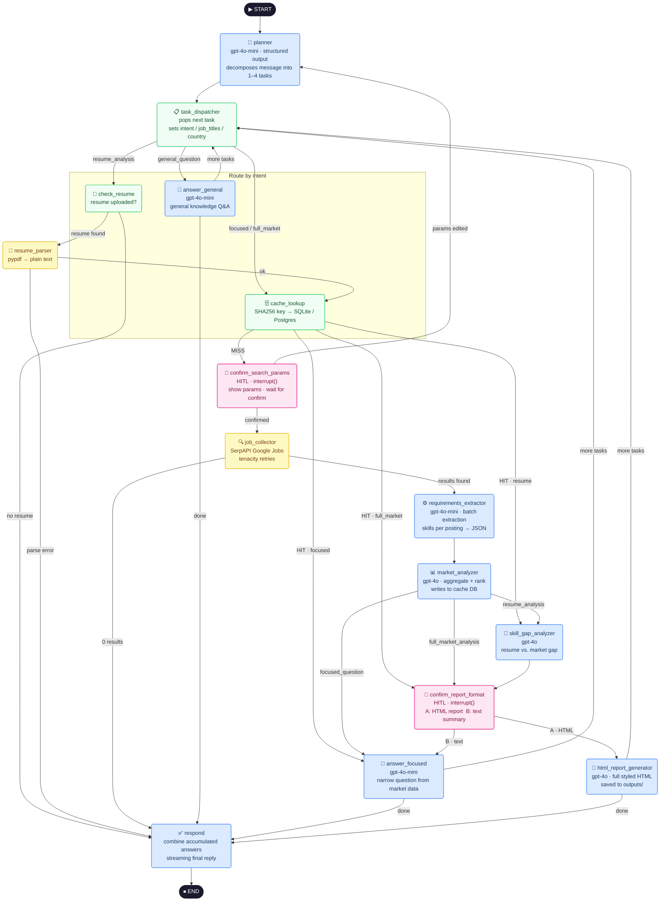

# Job Market Intelligence System

An agentic AI system that analyses real job market demand and delivers personalised resume recommendations. Built end-to-end with **LangGraph** to demonstrate production-grade agentic AI patterns: multi-task planning, dynamic intent routing, persistent caching, human-in-the-loop (HITL), structured LLM outputs, SSE streaming, and LangSmith evaluation.

> **Portfolio project** — showcasing skills in LangGraph, agentic system design, FastAPI, and LLM evaluation.

[](https://python.org)
[](https://langchain-ai.github.io/langgraph/)
[](https://fastapi.tiangolo.com)
[](https://smith.langchain.com)

---

## What It Does

Ask the system anything about the job market or your career in plain English:

| Request | What Happens |
|---|---|
| *"Full market analysis for AI Engineers in Germany"* | Searches real job postings via SerpAPI, aggregates skill demand with GPT-4o, generates a downloadable HTML report |
| *"Most in-demand cloud platforms for ML jobs in the UK?"* | Collects job data, extracts platform mentions per posting, answers the specific narrow question |
| *"What skills should I learn next?"* | Reads your uploaded resume, compares it against current market demand, recommends the highest-impact skills to acquire |
| *"Analyse AI jobs in Germany AND Data Engineer jobs in France"* | Detects a compound request, decomposes into 2 tasks, runs both pipelines, combines the answers into one reply |
| *"What is the difference between RAG and fine-tuning?"* | Answers directly from AI knowledge — no job data or API calls needed |

Before any expensive job search, the system pauses and asks you to confirm the parameters. After analysis it asks whether you want a full HTML report or a text summary. **You are always in control.**

---

## System Architecture

```
┌─────────────────────────────────────────────────────────────────┐
│                     GitHub Pages UI                             │
│            job-market-chat.html  (SSE token streaming)          │
└────────────────────────┬────────────────────────────────────────┘
                         │  HTTP + Server-Sent Events
┌────────────────────────▼────────────────────────────────────────┐
│                   FastAPI Backend                               │
│  POST /api/chat              POST /api/chat/{id}/reply (HITL)   │
│  POST /api/chat/{id}/resume  GET  /api/reports/{id}/{file}      │
└────────────────────────┬────────────────────────────────────────┘
                         │
┌────────────────────────▼────────────────────────────────────────┐
│                  LangGraph  StateGraph                          │
│                                                                 │
│   planner → task_dispatcher ──► [pipeline by intent] ──► respond│
│                   ▲                                     │       │
│                   └─────────────────────────────────────┘       │
│                         (loop if tasks remain)                  │
└──────┬─────────────────────────────────────┬────────────────────┘
       │                                     │
┌──────▼──────────────┐           ┌──────────▼──────────┐
│  SQLite / Postgres  │           │    OpenAI API        │
│                     │           │  gpt-4o-mini         │
│  · market cache     │           │  · planning          │
│  · LG checkpoints   │           │  · extraction        │
│  · conv history     │           │  gpt-4o              │
└─────────────────────┘           │  · analysis          │
                                  │  · report generation │
┌─────────────────────┐           └──────────────────────┘
│  SerpAPI            │
│  Google Jobs API    │           ┌──────────────────────┐
└─────────────────────┘           │  LangSmith           │
                                  │  · tracing           │
                                  │  · evaluation        │
                                  └──────────────────────┘
```

---

## LangGraph Graph

The graph is a `StateGraph` with **15 nodes**, a multi-task planner loop, and fully dynamic routing driven by user intent, cache state, and HITL replies.



---

## Node Reference

| Node | Category | Model | What it does |
|---|---|---|---|
| `planner` | LLM | gpt-4o-mini | Decomposes the user's message into an ordered list of 1–4 tasks using structured output. Each task maps to one of the 4 intents and carries job titles, country, and topic. |
| `task_dispatcher` | Logic | — | Pops the next task from the queue and writes its fields (`intent`, `job_titles`, `country`, `focused_topic`) to the shared state. Resets all per-task data so results from one task never bleed into the next. |
| `answer_general` | LLM | gpt-4o-mini | Answers general knowledge questions directly from AI knowledge. No tools, no job data. Supports token-level streaming. |
| `check_resume` | Logic | — | Checks the in-memory session store for an uploaded resume PDF. Routes to `resume_parser` if found, or surfaces an upload prompt if not. |
| `resume_parser` | Tool | pypdf | Extracts plain text from the uploaded PDF bytes. Handles encoding errors gracefully. |
| `cache_lookup` | DB | — | Computes `SHA256(sorted_titles + country + date)` and checks the SQLite/Postgres cache. Returns the stored analysis on a hit; proceeds to HITL on a miss. |
| `confirm_search_params` | **HITL** | — | Calls LangGraph's `interrupt()` — serialises state to the checkpointer, surfaces the proposed search parameters to the user, and waits for confirmation before spending SerpAPI credits. |
| `job_collector` | Tool | SerpAPI | Collects N real job postings from Google Jobs via SerpAPI. Uses `tenacity` for exponential backoff on rate limits. Early-exits with a message if 0 results are found. |
| `requirements_extractor` | LLM | gpt-4o-mini | Sends all job postings to the LLM in one batch. Extracts structured skills, cloud platforms, tools, and certifications per posting as JSON. Strips markdown fences before parsing. |
| `market_analyzer` | LLM | gpt-4o | Aggregates extracted requirements across all postings into a ranked markdown report. Writes the result to the cache DB with a 7-day TTL. |
| `skill_gap_analyzer` | LLM | gpt-4o | Compares the user's resume skills against market demand. Identifies gaps, prioritises recommendations, and estimates learning impact. |
| `answer_focused` | LLM | gpt-4o-mini | Extracts a narrow, specific answer from the market analysis markdown (e.g. "top cloud platforms" or "most required certifications"). |
| `confirm_report_format` | **HITL** | — | Second `interrupt()` — asks whether the user wants a full styled HTML report (option A) or a concise text summary in chat (option B). |
| `html_report_generator` | LLM + Tool | gpt-4o | Generates a complete, styled HTML report with sections, charts descriptions, and skill recommendations. Saves to `outputs/{session_id}/` and returns a URL. |
| `respond` | LLM | gpt-4o-mini | Collects all `accumulated_responses` from the task queue run. Single response: returned directly. Multiple responses: one LLM merge call with section headings. Streams the final reply. |

---

## Agentic Patterns

### 1 — Multi-Task Planning

The `planner` node is the first node on every turn. Instead of classifying a message into a single intent, it decomposes it into an ordered list of 1–4 sub-tasks using `gpt-4o-mini` with Pydantic structured output.

```
User: "Analyse AI Engineer jobs in Germany AND explain what LangGraph is"

planner → task_queue = [
  { intent: "full_market_analysis", job_titles: ["AI Engineer"], country: "Germany" },
  { intent: "general_question",     query: "explain what LangGraph is"              }
]

task_dispatcher pops task 1 → full pipeline runs → answer saved
task_dispatcher pops task 2 → answer_general runs → answer saved
respond → combines both answers into one reply
```

**Anti-over-decomposition:** The planner prompt includes explicit rules — *"What skills do AI and ML engineers need in Germany?"* is **1 task** (same market), not 2. The rule is: if in doubt, use 1 task.

---

### 2 — Human-in-the-Loop (HITL)

Two mandatory pause points use LangGraph's `interrupt()` mechanism:

```
confirm_search_params                    confirm_report_format
─────────────────────────                ─────────────────────────────
Fires before every SerpAPI call          Fires after market analysis
(cache miss only)                        (full_market + resume intents)

Shows:                                   Asks:
  Job titles : AI Engineer               A — Full HTML report
  Country    : Germany                      (detailed, downloadable)
  Posts      : 30                        B — Text summary in chat

User replies:
  "confirm" → proceeds                   User replies A or B
  "use 10 posts" → re-plans
```

**How it works technically:**
1. `interrupt(prompt)` serialises the complete graph state to SQLite/Postgres via the checkpointer and raises an internal exception that exits the graph cleanly
2. The API layer detects the pause with `graph.get_state(config)` and emits an `interrupt` SSE event to the frontend
3. The frontend renders the appropriate UI (confirm button or A/B choice)
4. The user's reply is sent to `POST /api/chat/{id}/reply`, which calls `graph.invoke(Command(resume=reply), config)` to resume from the exact checkpoint

---

### 3 — Persistent Caching

Market analysis is expensive (SerpAPI credits + multiple LLM calls). Results are cached globally — shared across all sessions because market data is not user-specific.

```
cache_key = SHA256(
    sorted(job_titles) +
    country.lower()    +
    today_as_string
)
```

- **Cache hit** — skip SerpAPI, skip extraction, skip analysis. Jump straight to answering.
- **Cache miss** — run the full pipeline, write result with a 7-day TTL.
- **`DISABLE_CACHE = True`** in `config.py` forces cache misses (useful during development).

---

### 4 — State Management

All nodes share a single `JobMarketState` TypedDict — a typed dictionary that acts as the graph's memory for the duration of a conversation turn.

```python
class JobMarketState(TypedDict):
    # Conversation
    messages: Annotated[list[BaseMessage], add_messages]  # append reducer
    session_id: str

    # Current task
    intent: Optional[str]
    job_titles: Optional[list[str]]
    country: Optional[str]

    # Multi-task planner
    task_queue: list[dict]           # remaining sub-tasks
    accumulated_responses: list[str] # partial answers per sub-task

    # Pipeline data
    raw_job_postings: Optional[list[dict]]
    extracted_requirements: Optional[list[dict]]
    market_analysis_markdown: Optional[str]
    resume_text: Optional[str]
    skill_gap_markdown: Optional[str]

    # HITL flags
    params_confirmed: bool
    report_confirmed: bool

    # Output
    final_text_response: Optional[str]
    html_report_path: Optional[str]
    cache_hit: bool
```

The `messages` field uses `Annotated[list, add_messages]` — LangGraph's append reducer that merges new messages without overwriting history, even across concurrent updates.

State is persisted between HTTP requests by `SqliteSaver` (dev) or `AsyncSqliteSaver` (FastAPI), so HITL pauses survive connection drops and the conversation can be resumed from any checkpoint.

---

### 5 — SSE Streaming

The frontend receives real-time updates via Server-Sent Events. The API uses `graph.astream_events("v2")` which emits fine-grained events for every LangChain/LangGraph operation.

```
node_start      → { "node": "job_collector" }        pipeline step indicator
intent_selected → { "intent": "focused_question" }   highlights intent in diagram
token           → { "content": "The top cloud..." }  LLM token (streamed)
interrupt       → { "prompt": "...", "session_id": "..." }  HITL pause
done            → { "final_text_response": "...", "html_report_path": "..." }
error           → { "detail": "..." }
```

Tokens from `answer_general`, `answer_focused`, and `respond` are streamed token-by-token to the frontend and rendered through `marked.parse()` on every event so markdown renders progressively rather than appearing all at once.

---

### 6 — LangSmith Evaluation

Three evaluation types are implemented as LangSmith datasets with results visible in the LangSmith UI.

```
python evaluation/run_all.py
```

#### Eval 1 — Final Answer Quality  (`eval-final-answer-v1`)

Runs the full graph end-to-end for 5 questions. An **LLM-as-a-judge** (gpt-4o-mini with structured output) scores each response against a reference answer on three axes:

| Metric | Description |
|---|---|
| `relevance` | Does the answer directly address what was asked? |
| `correctness` | Are the facts and recommendations accurate? |
| `completeness` | Does it cover all important aspects of the question? |

3 questions use `general_question` (OpenAI only, no SerpAPI). 2 use `focused_question` (SerpAPI + auto-confirmed HITL).

#### Eval 2 — Planner Node Isolation  (`eval-planner-v1`)

Calls `planner(state)` directly — no graph execution, no SerpAPI, no database. **8 examples** with **5 deterministic evaluators** (zero LLM judge calls):

| Evaluator | What it checks |
|---|---|
| `task_count_correct` | Exact match on number of tasks produced |
| `intent_correct` | All tasks have the correct intent (order-insensitive) |
| `no_over_decomposition` | Single-market queries produce exactly 1 task |
| `job_titles_extracted` | Job titles present when expected |
| `country_extracted` | Country field correctly identified |

Covers all 4 intents, anti-over-decomposition cases ("same market → 1 task"), and multi-task compound queries.

#### Eval 3 — Trajectory  (`eval-trajectory-v1`)

Captures the ordered list of node names that fire during graph execution using `graph.stream(stream_mode="updates")`. **3 questions** with **2 evaluators**:

| Evaluator | What it checks |
|---|---|
| `trajectory_exact_match` | Full node sequence matches exactly (1.0 or 0.0) |
| `trajectory_prefix_match` | Greedy subsequence score — partial credit for near-matches |

| Example | Expected trajectory |
|---|---|
| Simple general question | `planner → task_dispatcher → answer_general → respond` |
| Focused question (HITL) | `planner → task_dispatcher → cache_lookup → confirm_search_params → job_collector → requirements_extractor → market_analyzer → answer_focused → respond` |
| Compound general+general | `planner → task_dispatcher → answer_general → task_dispatcher → answer_general → respond` |

---

## Tech Stack

| Layer | Technology | Purpose |
|---|---|---|
| Agent orchestration | **LangGraph 0.2** | `StateGraph`, `interrupt()`, `SqliteSaver`, `astream_events` |
| LLM | **OpenAI GPT-4o / GPT-4o-mini** | Planning, extraction, analysis, generation |
| Job data | **SerpAPI Google Jobs** | Real-time job posting collection |
| PDF parsing | **pypdf** | Resume text extraction from uploaded bytes |
| Backend API | **FastAPI + sse-starlette** | SSE streaming, HITL resume, resume upload |
| Database (dev) | **SQLite + aiosqlite** | Market cache, LangGraph checkpoints |
| Database (prod) | **PostgreSQL** | Production-grade persistence on fly.io |
| Frontend | **Vanilla JS + GitHub Pages** | Chat UI, live diagram highlighting, HITL forms |
| Evaluation | **LangSmith** | Datasets, experiment tracking, LLM-as-a-judge |
| Retries | **tenacity** | Exponential backoff on SerpAPI rate limits |
| Deployment | **fly.io + Docker** | FastAPI backend containerised and deployed |

---

## Project Structure

```
job-market-intelligence-system/
│
├── graph/                          # LangGraph StateGraph
│   ├── state.py                    # JobMarketState TypedDict (20 fields)
│   ├── graph.py                    # StateGraph assembly, edges, checkpointer
│   ├── routing.py                  # 10 conditional routing functions (pure, unit-tested)
│   ├── session_store.py            # In-memory resume store keyed by session_id
│   └── nodes/
│       ├── planner.py              # Multi-task decomposition (gpt-4o-mini, Pydantic)
│       ├── task_dispatcher.py      # Pops task queue, resets per-task state
│       ├── answer_general.py       # General Q&A (streaming)
│       ├── check_resume.py         # Resume availability check (no LLM)
│       ├── resume_parser.py        # PDF → text via pypdf
│       ├── cache_lookup.py         # SHA256 key → DB cache check
│       ├── hitl.py                 # confirm_search_params + confirm_report_format
│       ├── job_collector.py        # SerpAPI collection, 0-results short-circuit
│       ├── requirements_extractor.py  # Batch skill extraction (gpt-4o-mini)
│       ├── market_analyzer.py      # Aggregation + cache write (gpt-4o)
│       ├── skill_gap_analyzer.py   # Resume vs. market gap (gpt-4o)
│       ├── answer_focused.py       # Narrow question answering
│       ├── html_report_generator.py   # Styled HTML report (gpt-4o)
│       └── respond.py              # Combine accumulated answers, stream reply
│
├── api/                            # FastAPI backend
│   ├── main.py                     # App setup, CORS, static mount
│   ├── dependencies.py             # Graph singleton (AsyncSqliteSaver)
│   └── routers/
│       ├── chat.py                 # POST /api/chat + /api/chat/{id}/reply (SSE + HITL)
│       ├── resume.py               # POST /api/chat/{id}/resume (PDF upload)
│       └── history.py              # GET /api/chat/{id}/history
│
├── tools/
│   ├── google_jobs_tool.py         # LangChain BaseTool, async, tenacity retries
│   ├── resume_pdf_tool.py          # Accepts bytes, returns text via pypdf
│   ├── html_report_saver.py        # Saves to outputs/{session_id}/, returns URL
│   ├── market_cache_tool.py        # MarketCacheReadTool + MarketCacheWriteTool
│   └── conversation_store.py       # ConversationSaveTool + ConversationGetTool
│
├── evaluation/                     # LangSmith evaluation suite
│   ├── eval_final_answer.py        # Eval 1: end-to-end answer quality (LLM judge)
│   ├── eval_planner.py             # Eval 2: planner node isolation (deterministic)
│   ├── eval_trajectory.py          # Eval 3: node sequence verification
│   ├── run_all.py                  # Run all 3 evals (cheapest first)
│   └── shared/
│       ├── graph_runner.py         # HITL-aware runner + trajectory capture
│       ├── dataset_utils.py        # Idempotent LangSmith dataset upsert
│       └── llm_judge.py            # Relevance / correctness / completeness judge
│
├── db/
│   ├── connection.py               # Sync SQLite connection (tests / scripts)
│   ├── models.py                   # Table definitions
│   └── migrations/001_initial_schema.sql
│
├── tests/
│   └── test_graph_routing.py       # 25+ routing unit tests (no LLM, no API keys)
│
├── personal_website/               # GitHub Pages portfolio site (separate git repo)
│   └── job-market-chat.html        # Live demo chat UI
│
├── run_tests.py                    # Non-interactive integration test runner
├── test_google_jobs_tool.py        # Interactive SerpAPI debug runner
├── config.py                       # DISABLE_CACHE, DEFAULT_TOTAL_POSTS, CACHE_TTL_DAYS
├── Dockerfile
├── fly.toml
└── requirements.txt
```

---

## Getting Started

### Prerequisites

- Python 3.12+
- [OpenAI API key](https://platform.openai.com/)
- [SerpAPI key](https://serpapi.com/) — for job data (free tier: 100 searches/month)
- [LangSmith account](https://smith.langchain.com) — for evaluation (free tier available)

### Installation

```bash
git clone https://github.com/your-username/job-market-intelligence-system
cd job-market-intelligence-system

python -m venv .venv
source .venv/bin/activate        # Windows: .venv\Scripts\activate

pip install -r requirements.txt
```

Create `.env`:

```bash
# Required
OPENAI_API_KEY=sk-...
SERPAPI_API_KEY=...

# LangSmith (required for evaluation, optional for basic use)
LANGSMITH_API_KEY=lsv2_pt_...
LANGSMITH_PROJECT=job-market-intelligence-system
LANGSMITH_TRACING=true

# Database (leave blank to use SQLite)
DATABASE_URL=
DB_PATH=job_market.db

# Tuning
CACHE_TTL_DAYS=7
DEFAULT_TOTAL_POSTS=5      # use 30 for production-quality analysis
DISABLE_CACHE=True         # set False to enable caching
```

### Run Tests

```bash
# Routing unit tests — no API keys needed, runs in < 1 second
python -m pytest tests/test_graph_routing.py -v

# Integration tests — requires API keys
python run_tests.py general        # LLM only, cheapest (~$0.001)
python run_tests.py focused        # SerpAPI + 1 HITL interrupt
python run_tests.py market         # Full pipeline + 2 HITL interrupts
python run_tests.py report         # Full pipeline + HTML report generation
python run_tests.py cache          # Verify cache hit (run after market/focused)
python run_tests.py resume_missing # Error handling test
python run_tests.py resume         # Place your resume as Resume.pdf in root first
python run_tests.py all
```

### Run LangSmith Evaluations

```bash
# All 3 evaluations (cheapest first — fails fast if planner is broken)
python evaluation/run_all.py

# Individually
python evaluation/eval_planner.py       # ~8 OpenAI calls, no SerpAPI
python evaluation/eval_trajectory.py    # includes 1 full pipeline run
python evaluation/eval_final_answer.py  # includes 2 SerpAPI calls
```

Results appear in your LangSmith project under experiments:
`planner-node-isolation`, `trajectory-node-sequence`, `final-answer-quality`.

### Start the API

```bash
uvicorn api.main:app --reload --port 8000
```

---

## API Reference

| Method | Endpoint | Description |
|---|---|---|
| `POST` | `/api/chat` | Start a new turn. Body: `{message, session_id, total_posts}`. Returns SSE stream. |
| `POST` | `/api/chat/{id}/reply` | Resume after HITL interrupt. Body: `{reply}`. Returns SSE stream. |
| `POST` | `/api/chat/{id}/resume` | Upload a resume PDF (max 10 MB). |
| `GET` | `/api/chat/{id}/history` | Fetch past messages (`?limit=50`). |
| `GET` | `/api/reports/{id}/{file}` | Serve a generated HTML report. |

### SSE Event Stream

```
event: node_start
data: {"node": "job_collector"}

event: intent_selected
data: {"intent": "focused_question"}

event: token
data: {"content": "The most in-demand cloud platform..."}

event: interrupt
data: {"prompt": "I'm about to search... press **confirm**", "session_id": "abc123"}

event: done
data: {"session_id": "abc123", "final_text_response": "...", "html_report_path": null, "cache_hit": false}
```

---

## Implementation Phases

| Phase | Status | What was built |
|---|---|---|
| **1 — Core Graph** | ✅ Complete | LangGraph StateGraph, 15 nodes, 5 tools, SQLite cache, HITL via terminal, 25+ unit tests |
| **2 — FastAPI Backend** | ✅ Complete | SSE streaming, HITL over HTTP, resume upload, session isolation, fly.io deployment |
| **3 — Frontend + Planner** | ✅ Complete | GitHub Pages chat UI, multi-task planner, resume upload, streaming markdown, intent diagram |
| **3.5 — UX Polish** | ✅ Complete | Step indicator, 0-results handling, live node highlighting, streaming markdown via marked.js |
| **4 — Evaluation** | ✅ Complete | LangSmith evaluation suite: final answer quality, planner isolation, trajectory verification |

---

## Database Schema

```
market_analysis_cache                   conversation_history
──────────────────────────────          ──────────────────────────────
cache_key   TEXT  UNIQUE (SHA256)       id          INTEGER PRIMARY KEY
job_titles  TEXT  (JSON array)          session_id  TEXT
country     TEXT                        role        TEXT  (human / ai)
analysis_date TEXT                      content     TEXT
market_analysis_markdown  TEXT          created_at  TEXT
extracted_requirements    TEXT (JSON)
total_posts INTEGER
created_at  TEXT
expires_at  TEXT  (cache_key + 7d TTL)

+ LangGraph checkpointer tables — auto-managed by SqliteSaver / AsyncSqliteSaver
```

---

## Key Design Decisions

**Why `gpt-4o-mini` for planning and extraction, `gpt-4o` for analysis?**
Decomposing intent and extracting structured data from short text is a classification task that `gpt-4o-mini` handles reliably at ~10x lower cost. The aggregation and synthesis steps — where model quality visibly affects output — use `gpt-4o`.

**Why synchronous node functions with async streaming?**
All graph nodes use `def` (not `async def`) with `llm.invoke()`. LangGraph's `astream_events()` still emits token-level events because `streaming=True` on the LLM is handled at the LangChain level, below the node. This lets the same node code work in both `graph.invoke()` (integration tests) and `graph.astream_events()` (FastAPI) without duplication.

**Why a separate `task_dispatcher` node?**
Making the loop step a named node means it appears in LangSmith traces and SSE `node_start` events, making the multi-task execution flow debuggable and visible in the frontend diagram.

**Why SHA256 cache keys tied to the date?**
Job market data changes daily. Tying the key to `today's date` ensures users always get fresh data while still benefiting from cache hits within the same day.

**Why `stream_mode="updates"` for trajectory evaluation?**
`astream_events()` emits many sub-events per node (one per token). `stream_mode="updates"` emits exactly one chunk per node execution (`{node_name: state_delta}`), making it trivial to collect the ordered node sequence without noise.
